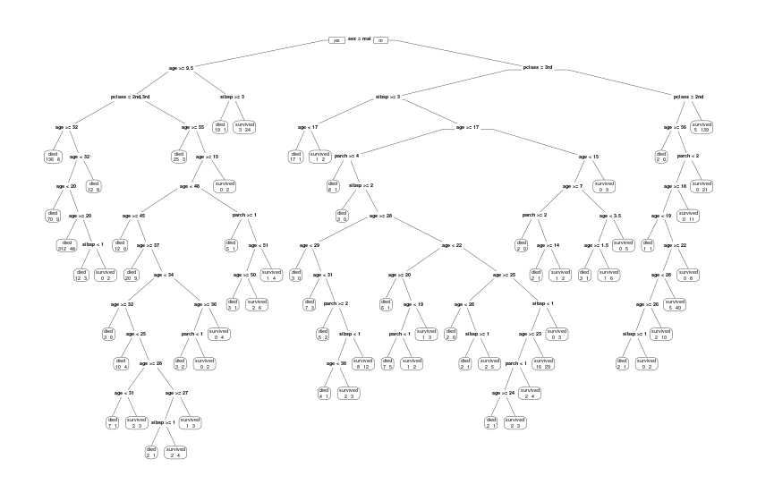
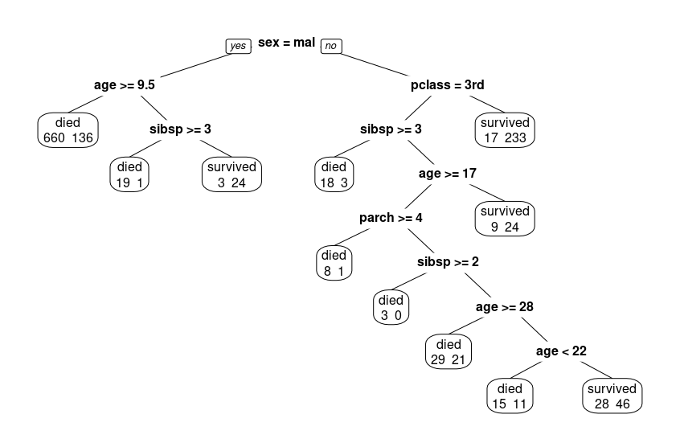
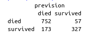

# Decision Tree - Titanic case study

## Description

The objective is to build a model which can  predict whether a Titanic's passenger is a "survivor" or “dead” according to other variables, ticket class, age, sex,… . 

## The model

To build the model, you have to run `Titanic.r`.

### Construct a tree 
Using `rpart` function :

### Prune the tree
Using `prune` function :

### Matrix of confusion
Using `predict` function :

